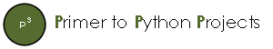

A simple guide to getting started with Python projects

1. [Data Loading](http://nbviewer.ipython.org/urls/raw.githubusercontent.com/rphoa/python-project-primer/master/notebooks/1.%20Data%20Loading.ipynb)
2. [Data Manipulation](http://nbviewer.ipython.org/urls/raw.githubusercontent.com/rphoa/python-project-primer/master/notebooks/2.%20Data%20Manipulation.ipynb)
3. [Modelling](http://nbviewer.ipython.org/urls/raw.githubusercontent.com/rphoa/python-project-primer/master/notebooks/3.%20Modelling.ipynb)
4. [Saving Output](http://nbviewer.ipython.org/urls/raw.githubusercontent.com/rphoa/python-project-primer/master/notebooks/4.%20Saving%20Output.ipynb)
